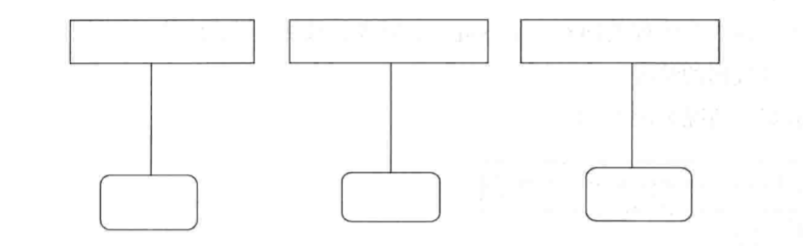
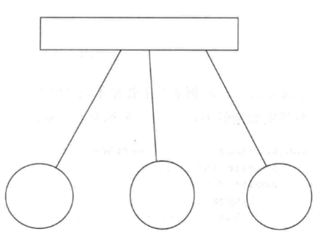
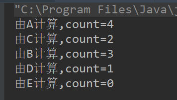

### 什么是进程

+ 进程（Process）是计算机中的程序关于某数据集合上的一次运行活动，是系统进行资源分配和调度的基本单位，是操作系统结构的基础。在早期面向进程设计的计算机结构中，进程是程序的基本执行实体；在当代面向线程设计的计算机结构中，进程是线程的容器。程序是指令、数据及其组织形式的描述，进程是程序的实体。 

### 什么是线程

+ 线程是程序中一个单一的顺序控制流程。进程内有一个相对独立的、可调度的执行单元，是系统独立调度和分派CPU的基本单位指令运行时的程序的调度单位。在单个程序中同时运行多个线程完成不同的工作，称为多线程

### 实现多线程的方式

+ 继承Thread类

  - ```java
    public class MyThread extends Thread {
    
        @Override
        public void run() {
            super.run();
            System.out.println("MyThread");
        }
    }
    ```

  - ```java
    public class Run {
        public static void main(String []args){
            MyThread myThread = new MyThread();
            myThread.start();
            System.out.println("run end");
        }
    }
    ```

+ 实现Runnable接口

  - ```java
    public class MyRunnable implements Runnable{
        @Override
        public void run() {
            System.out.println("运行中！");
        }
    }
    ```

  - ```java
    public class Run {
        public static void main(String []args){
            Runnable runnable = new MyRunnable();
            Thread thread = new Thread(runnable);
            thread.start();
            System.out.println("运行结束");
        }
    }
    ```

使用多线程技术的时候，代码的运行结果与代码执行顺序或调用顺序是无关的

### 实例变量和线程安全

自定义线程类中的实例变量针对其他线程可以有共享与不共享之分，这在多个线程之间进行交互时是很重要的一个技术点

+ 不共享数据的情况

  - 

  - ```java
    public class MyThread extends Thread {
        private int count = 5 ;
        public MyThread(String name){
            super();
            this.setName(name); //设置线程名称
        }
    
        @Override
        public void run() {
            super.run();
            while (count>0){
                count--  ;
                System.out.println("由"+this.currentThread().getName()+"计算,count="+count);
            }
        }
    }
    ```

  - ```java
    public class Run {
        public static void main(String []args){
            MyThread a = new MyThread("a");
            MyThread b = new MyThread("b");
            MyThread c = new MyThread("c");
            a.start();
            b.start();
            c.start();
        }
    }
    ```

+ 共享数据的情况

  - 

  - ```java
    public class MyThread extends Thread{
        private int count = 5 ;
    
        @Override
        public void run() {
            super.run();
            count -- ;
            //此代码不要用for语句，因为使用同步后其他线程就得不到运行的机会了
            //一直由一个线程进行减法运算
            System.out.println("由"+this.currentThread().getName()+"计算,count="+count);
        }
    }
    ```

  - ```java
    public class Run {
        public static void main(String []args){
            MyThread myThread  = new MyThread();
            Thread a = new Thread(myThread,"A");
            Thread b = new Thread(myThread,"B");
            Thread c = new Thread(myThread,"C");
            Thread d = new Thread(myThread,"D");
            Thread e = new Thread(myThread,"E");
            a.start();
            b.start();
            c.start();
            d.start();
            e.start();
        }
    }
    
    ```

  - 

  - 在某些JVM中，i--的操作要分为3部分

    - 取得原有i值
    - 计算i-1
    - 对i进行赋值
    - 在这3个步骤中，如果有多个线程同时访问，那么一定会出现非线程安全问题

  - ```java
    public class MyThread extends Thread {
        private int count = 5;
    
        @Override
        synchronized public void run() {
            super.run();
            count--;
            //此代码不要用for语句，因为使用同步后其他线程就得不到运行的机会了
            //一直由一个线程进行减法运算
            System.out.println("由" + this.currentThread().getName() + "计算,count=" + count);
        }
    }
    
    ```

  - **通过在run方法前加入synchronized关键字，使多个线程在执行run方法时，以排队的方式进行处理。当一个线程调用run前，先判断run方法有没有被上锁，如果上锁，说明有其他的线程正在调用run方法，必须等其他线程对run方法调用结束后才可以执行run方法。这样也就实现了排队调用run方法的目的，也就达到了按顺序对count变量减1的效果了。synchronized可以在任意对象及方法上加锁，而加锁的这段代码称为“互斥区”或“临界区”。**

### 非线程安全

非线程安全主要是值多个线程对同一个对象中的同一个实例变量进行操作时会出现值被更改、值不同步的情况，进而影响程序的执行流程

```java
/***
 *  ClassName : LoginServlet
 *  Author    : lin
 *  Date      : 2018/12/10 17:14    
 *  Remark    : 本类来模拟一成一个Servlet组件
 */

public class LoginServlet {
    private static String usernameRef;
    private static String passwordRef;

    synchronized public static void doPost(String username, String password) {
        try {
            usernameRef = username;
            if (username.equals("a")) {
                Thread.sleep(5000);
            }
            passwordRef = password;
            System.out.println("username= " + usernameRef + " password=" + password);
        } catch (Exception e) {
            e.printStackTrace();
        }
    }
}
```

```java
public class ALogin extends Thread{
    @Override
    public void run() {
        LoginServlet.doPost("a","aa");
    }
}
```

```java
public class BLogin extends Thread {
    @Override
    public void run() {
        LoginServlet.doPost("b","bb");
    }
}
```

```java
public class Run {
    public static void main(String []args){
        ALogin a= new ALogin();
        a.start();
        BLogin b= new BLogin();
        b.start();
    }
}
```

### currentThread()方法

currentThread()方法可以返回代码段正在被哪个线程调用的信息。

### isAlive()方法

+ isAlive()方法的功能是判断当前的线程是否处于活动状态
+ 活动状态就是线程已经启动且尚未终止。线程处于正在运行或者准备开始运行的状态，就认为线程是”存活“的。

### sleep()方法

+ 方法sleep()的作用是在指定的毫秒数内让当前“正在执行的线程”休眠（暂停执行）。这个“正在执行的线程”是指`this.currentThread()`返回的线程.

### getId()方法

+ getId()方法的作用是取得线程的唯一标识

### 停止线程

停止一个线程意味着在线程处理完任务之前停掉正在做的操作，也就是放弃当前的操作

在JAVA中有3中方法可以终止正在运行的线程

+ 使用退出标志，使线程正常退出，也就是当run方法完成后线程终止
+ 使用stop方法强行终止线程，但是不推荐使用这个方法， 因为stop和suspend及resume一样，都是过期作废的方法，使用它们可能产生不可预料的结果
+ 使用interrupt方法中断线程


