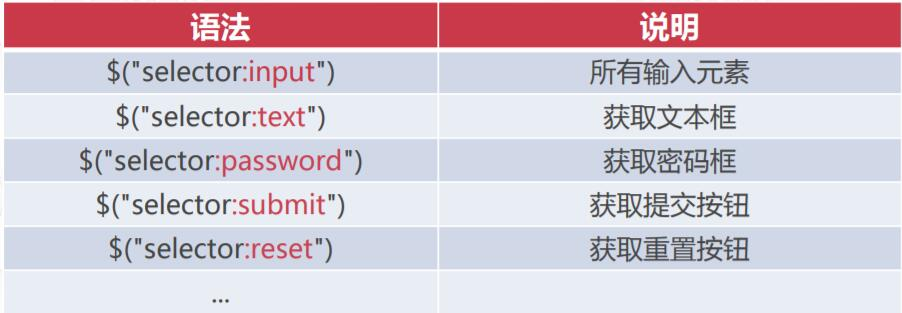

## jQuery

### jQuery介绍

+ jQuery是一个轻量级JS库，使用十分简单
+ jQuery的核心是选择器，用于获取页面元素
+ jQuery提供了大量高效方法，开发速度大幅提升

------

### jQuery选择器

```javascript
<script type="text/javascript" src="js/jquery-3.3.1.js" ></script>
	<script  type="text/javascript" >
		document.getElementById("btnSelect").onclick =function(){
			var selector= document.getElementById("txtSelector").value;
			//jquery的选择器方法
			//选择器表达式
			// $("*").removeClass('highlight');
			// $(selector).addClass('highlight');
			// $("#marital_status").addClass('highlight');
			$("div").addClass('highlight')
		}
	</script>
```

+ jQuery选择器用于选中需要操作的页面元素
+ 语法1：`jQuery(选择器表达式)`
+ 语法2：`$(选择器表达式)`
+ 俩种是等价的

#### 基本选择器

+ 基本选择器是jQuery最基础也是最常用的选择器表达式
+ 

#### 层叠选择器

+ 层叠选择器是根据元素的位置关系来获取元素的选择器表达式
+ 

#### 属性选择器

+ 属性选择器就是根据元素的属性值来选择元素的选择器表达式
+ 

#### 位置选择器

+ 位置选择器是指通过位置获取指定的元素，例如“获取第3个元素”
+ 

#### 表单选择器

+ 表单选择器是获取表单元素的简化形式，例如：获取所有文本框
+ 

- 

------

### WEB页面开发的两个要素

- 在使用HTML开发页面时，有两个基本点：
  - **选择**HTML页面上在哪些元素
  - 在这些元素上做哪些**动作**

#### 操作元素属性

- `attr(name|properties|key)`：获取或设置元素属性
- `removeAttr(name)`:移除元素属性

#### 操作元素的CSS样式

- `css()`:获取或设置匹配元素的样式属性
- `addClass()`:为每个匹配的元素添加指定的类名
- `removeClass()`:从所有匹配的元素中删除全部或指定的类

#### 设置元素内容

- `val()`:获取或设置输入项的值
- `text()`:获取或设置元素的纯文本
- `html()`:获取或设置元素内部的HTML

#### jQuery事件处理方法

+ `on("click",function)`：为选中的页面元素绑定单击事件
+ `click(function)`:是绑定事件的简写形式
+ 处理方法中提供了event参数包含了事件的相关信息
+ 

----------

## Ajax

### Ajax介绍

+ Asynchronous JavaScript And XML(异步的JavaScript和XML)
+ Ajax可以再不刷新页面的前提下，进行页面局部更新
+ Ajax不是新的技术，Ajax并不是W3C的标准

### Ajax的使用流程

+ 创建XmlHttpRequest对象
+ 发送Ajax请求
+ 处理服务器响应

#### 创建XMLHttpRequest对象

+ XMLHttpRequest用于在后台与服务器交换数据，是Ajax的核心

+ XMLHttpRequest并不是W3C的标准，不同浏览器的创建方式不同

+ ```javascript
   //1.创建XMLHttpRequest对象
              //2.发送AJAX请求
              //3.处理服务器响应
              var xmlhttp;
              if (window.XMLHttpRequest){
                  //IE7+,Firefox,Chrome,Opera,Safari浏览器执行代码
                  xmlhttp = new XMLHttpRequest();
              }else {
                  //IE6,IE5浏览器执行代码
                  xmlhttp = new ActiveXObject("Microsoft.XMLHTTP");
              }
              console.log(xmlhttp);
   ```
  ```

#### 发送Ajax请求

+ `xmlhttp.open()`用于创建请求

+ `xmlhttp.send()`用于发送请求

+ ```javas
   //创建请求
   xmlhttp.open("GET","http://localhost/test?name=admin",true);  //true是异步，false是同步
   //发送到服务器
   xmlhttp.send();
  ```

#### 处理服务器响应

+ `xmlhttp.onreadystatechange()`事件用于监听AJAX的执行过程

+ `xmlhttp.readyState`属性说明XMLHttpRequest当前状态

+ `xmlhttp.status`属性服务器响应状态码，200:成功  404:未找到....

+ 

+ ```javasc
  //处理服务器响应
  xmlhttp.onreadystatechange = function(){
      //响应已被接收且服务器处理成功时才执行
      if(xmlhttp.readyState==4&&xmlhttp.status == 200){
          //获取响应体文本
          var responseText = xmlhttp.responseText ;
          //对服务器结果进行处理
          .....
      }
  }
  ```


### jQuery对Ajax的支持

+ jQuery对Ajax进行封装，提供了`$.ajax()`方法

+ 语法:`$.ajax(options)`

+ 

+ 服务端代码

+ ```java
  public class MusicServlet extends HttpServlet {
  
      @Override
      protected void doGet(HttpServletRequest req, HttpServletResponse resp) throws ServletException, IOException {
          String t = req.getParameter("t");
          List<Music> list = new ArrayList<>();
  
          if (t != null && t.equals("liuxing")) {
              list.add(new Music("稻香"));
              list.add(new Music("晴天"));
              list.add(new Music("告白气球"));
          } else if (t != null && t.equals("jingdian")) {
              list.add(new Music("千千厥歌"));
              list.add(new Music("傻女"));
              list.add(new Music("七友"));
          } else if (t != null && t.equals("yaogun")) {
              list.add(new Music("一块红布"));
              list.add(new Music("假行僧"));
              list.add(new Music("新长征路上的摇滚"));
          }else {
              resp.setContentType("text/html;charset=utf-8");
              resp.getWriter().println("无数据");
          }
  
          String json = JSON.toJSONString(list);
          resp.setContentType("text/html;charset=utf-8");
          resp.getWriter().println(json);
      }
  }
  
  ```

+ 配置Servlet

+ ```xml
   <servlet>
          <servlet-name>music</servlet-name>
          <servlet-class>com.nuc.work.MusicServlet</servlet-class>
      </servlet>
      <servlet-mapping>
          <servlet-name>music</servlet-name>
          <url-pattern>/music</url-pattern>
      </servlet-mapping>
  ```

+ 前端代码

+ ```html
  <!DOCTYPE html>
  <html lang="en">
  <head>
      <meta charset="UTF-8">
      <title>Title</title>
  
  </head>
  <body>
  <div>
      <button id="liuxing" type="button">流行歌曲</button>
      <button id="jingdian" type="button">经典歌曲</button>
      <button id="yaogun" type="button">摇滚歌曲</button>
  </div>
  <div id="content"></div>
  
  <script type="text/javascript" src="js/jquery-3.3.1.js"></script>
  <script type="text/javascript">
      var flag = "";
      $("#liuxing").on("click", function () {
          flag = "liuxing";
          AJAX(flag);
      });
      $("#jingdian").on("click", function () {
          flag = "jingdian";
          AJAX(flag);
  
      });
      $("#yaogun").on("click", function () {
          flag = "yaogun";
          AJAX(flag);
      });
  
      function AJAX(flag) {
          $("#content").html("");
          $.ajax({
              url: "http://localhost:8080/music",
              type: "get",
              data: {
                  t: flag
              },
              dataType: "json",
              success: function (json) {
                  for (var i = 0; i < json.length; i++) {
                      $("#content").append("<h1>" + json[i].name + "</h1><hr>")
                  }
              },
              error: function (xmlhttp, errorText) {
                  console.log(xmlhttp);
                  console.log(errorText);
                  if (xmlhttp.status == "405") {
                      alert("无效的请求方式");
                  } else if (xmlhttp.status == "404") {
                      alert("未找到URL资源");
                  } else if (xmlhttp.status == "500") {
                      alert("服务器内部错误，请联系管理员");
                  } else {
                      alert("发生异常，请联系管理员");
                  }
              }
          })
      }
  </script>
  </body>
  </html>
  ```

  
